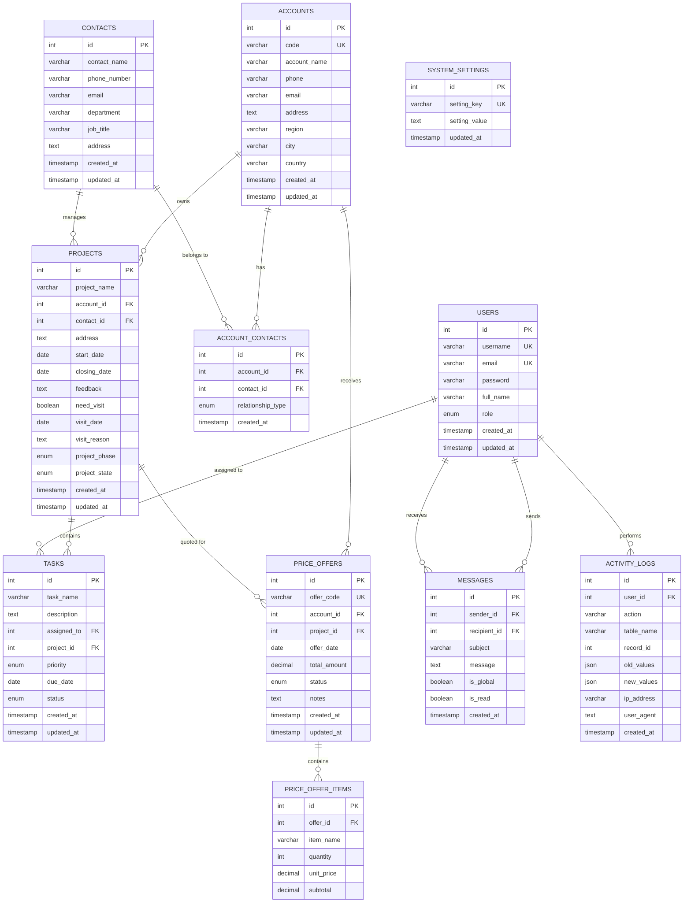

# ShortCircuit CRM Database Entity Relationship Diagram

## Mermaid ERD Code
Copy this code and paste it into draw.io (Mermaid mode) or any Mermaid-compatible tool:



## Database Relationships Explanation

### Primary Relationships:

1. **ACCOUNTS ↔ CONTACTS** (Many-to-Many)
   - Junction table: `ACCOUNT_CONTACTS`
   - Relationship types: Primary, Secondary

2. **ACCOUNTS → PROJECTS** (One-to-Many)
   - One account can have multiple projects
   - Each project belongs to one account

3. **CONTACTS → PROJECTS** (One-to-Many)
   - One contact can manage multiple projects
   - Each project has one primary contact

4. **PROJECTS → TASKS** (One-to-Many)
   - One project can have multiple tasks
   - Each task belongs to one project

5. **USERS → TASKS** (One-to-Many)
   - One user can be assigned multiple tasks
   - Each task is assigned to one user

6. **ACCOUNTS → PRICE_OFFERS** (One-to-Many)
   - One account can receive multiple offers
   - Each offer is for one account

7. **PROJECTS → PRICE_OFFERS** (One-to-Many)
   - One project can have multiple offers
   - Each offer is for one project

8. **PRICE_OFFERS → PRICE_OFFER_ITEMS** (One-to-Many)
   - One offer can contain multiple items
   - Each item belongs to one offer

9. **USERS → MESSAGES** (One-to-Many)
   - Users can send and receive messages
   - Messages can be global or personal

10. **USERS → ACTIVITY_LOGS** (One-to-Many)
    - All user actions are logged
    - Complete audit trail

## Key Design Features:

### Auto-Generated Codes:
- **ACCOUNTS.code**: Format A0001, A0002, etc.
- **PRICE_OFFERS.offer_code**: Format O0001, O0002, etc.

### Enum Values:
- **USERS.role**: admin, worker
- **ACCOUNT_CONTACTS.relationship_type**: Primary, Secondary
- **PROJECTS.project_phase**: Planning, Execution, Monitoring, Closure
- **PROJECTS.project_state**: Pre-started, Started, Finished
- **TASKS.priority**: High, Medium, Low
- **TASKS.status**: Pending, In Progress, Done
- **PRICE_OFFERS.status**: Draft, Sent, Accepted, Rejected

### JSON Fields:
- **ACTIVITY_LOGS.old_values**: Previous data before change
- **ACTIVITY_LOGS.new_values**: New data after change

### Audit Trail:
- **ACTIVITY_LOGS**: Complete logging of all changes
- **IP tracking**: User IP address and user agent
- **Timestamp tracking**: Created/updated timestamps on all tables

## Indexes for Performance:

```sql
-- Primary indexes
CREATE INDEX idx_accounts_code ON accounts(code);
CREATE INDEX idx_projects_account ON projects(account_id);
CREATE INDEX idx_tasks_assigned ON tasks(assigned_to);
CREATE INDEX idx_tasks_project ON tasks(project_id);
CREATE INDEX idx_activity_logs_user ON activity_logs(user_id);
CREATE INDEX idx_activity_logs_table ON activity_logs(table_name);

-- Foreign key indexes
CREATE INDEX idx_account_contacts_account ON account_contacts(account_id);
CREATE INDEX idx_account_contacts_contact ON account_contacts(contact_id);
CREATE INDEX idx_projects_contact ON projects(contact_id);
CREATE INDEX idx_price_offers_account ON price_offers(account_id);
CREATE INDEX idx_price_offers_project ON price_offers(project_id);
CREATE INDEX idx_price_offer_items_offer ON price_offer_items(offer_id);
CREATE INDEX idx_messages_sender ON messages(sender_id);
CREATE INDEX idx_messages_recipient ON messages(recipient_id);
```

## Data Flow:

1. **Account Creation** → **Contact Assignment** → **Project Creation** → **Task Assignment**
2. **Price Offer Creation** → **Item Addition** → **Status Updates**
3. **All Actions** → **Activity Logging** → **Audit Trail**

This database design supports the complete CRM workflow from initial contact to project completion and sales closure.
